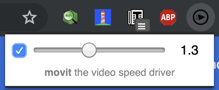

# movit

the video speed driver

  * it modifies the `<video>` playback rate from `0.1` to `3x`
  * it does absolutely nothing when it's disabled (_unchecked_)

by [@WebReflection](https://twitter.com/WebReflection)

